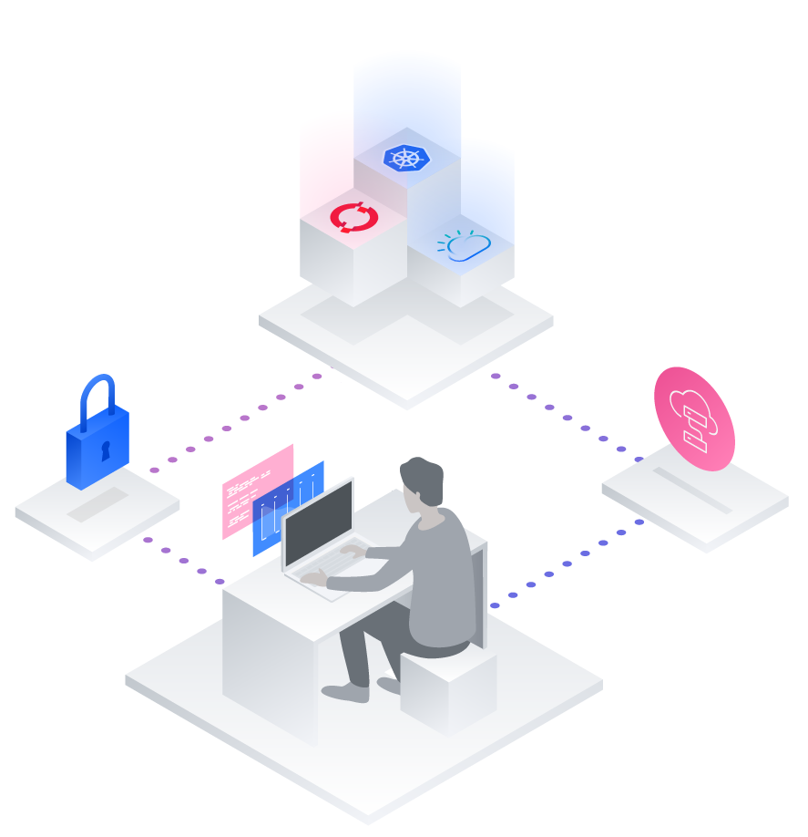

## Digital Developer Conference Hybrid Cloud - Lab Stream

Welcome to our conference! In this set of workshops we'll be using discussing various concepts of Build Smart Build Secure all while setting up an example application. The goals of these workshops are:

* Learn how to use IBM Cloud App ID
* Use Operators in OpenShift OperatorHub
* Build and Deploy microservices in OpenShift
* Install and use OpenShift Serverless and OpenShift Service Mesh
* Have fun!

### About this conference

During the conference you'll learn how to use open source technologies, frameworks, and platforms like Kubernetes, Tekton, and Red Hat® OpenShift® on IBM Cloud® to support your application modernization or cloud migration skills, through sessions on application development and DevOps implementation, plus hands-on labs.

Hands-on Lab track:

* [1. Threat Modeling and Identity Management](appid/threat-modeling.md)
* [2. Operator Workshop](operators/README.md)
* [3. Microservice Workshop](microservices/introduction.md)
* [4. Serverless Workshop](serverless/introduction/example-bank-app-architecture.md)
* [5. Service Mesh Workshop](mesh-lab/lab5.md)
* [6. Pipelines (Tekton) Workshop](tekton/intro.md)

We have a dedicated Slack channel for you to ask questions or for help in our workshops:

**#ddc-hybrid-labs**

*You should have received the invitation to the Digital Developer Conference workspace in your email.*

## Credits

* [@AnthonyAmanse](https://twitter.com/AnthonyAmanse)
* [@antonmc](https://twitter.com/antonmc)
* [@olaph5](https://twitter.com/olaph5)
* [@yankoyfman](https://twitter.com/yankoyfman)
