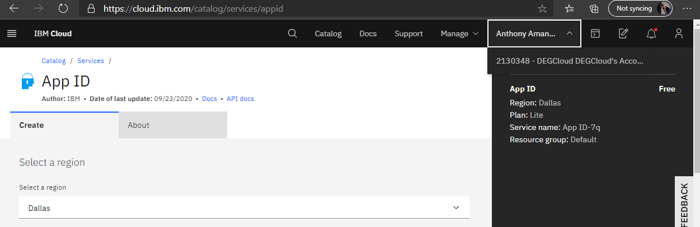
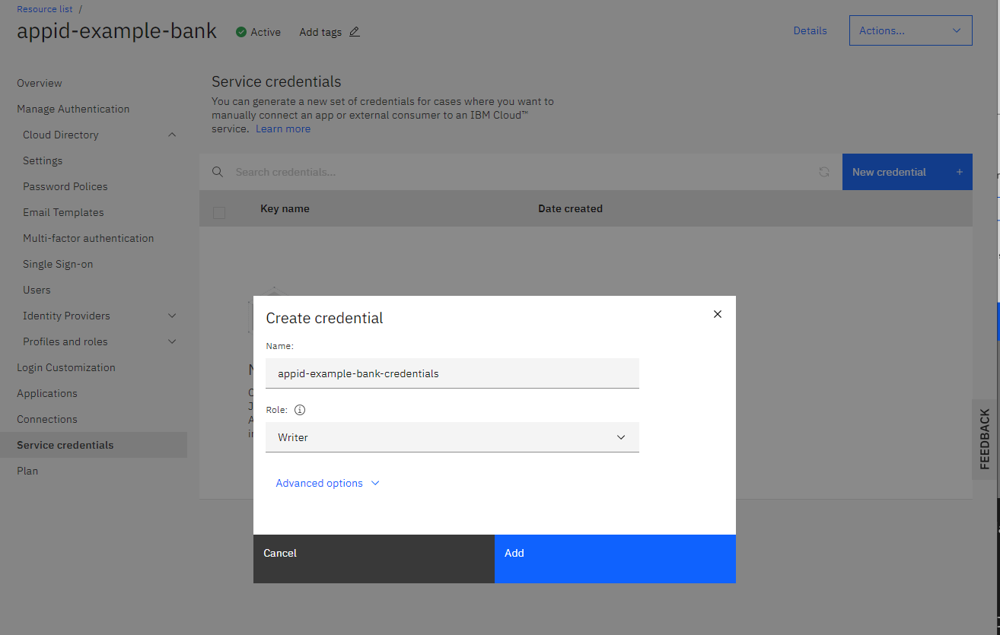

# Creating App ID in IBM Cloud

## 1. Create IBM Cloud App ID instance

Create one with a name of **appid-example-bank** using the IBM Cloud dashboard https://cloud.ibm.com/catalog/services/appid

**NOTE: Make sure you are using your personal account**



## 2. Configure App ID

* Allow Sign-up and Sign-in using username and password by going to the tab `Cloud Directory` > `Settings`


* Disable Email Verification by going to the tab `Cloud Directory` > `Email Templates` > `Email verification`


* Add an application called **mobile-simulator** in the `Applications` tab. Select "Regular web application". Make sure you also add an `admin` scope.


* Create the `admin` role. The scope would be `mobile-simulator/admin`.


* Create Service credentials with the **Writer** Role so that the simulator can create simulated users with the App ID instance. Name it **appid-example-bank-credentials**



## 3. Create secrets

* Create secrets of App ID credentials for OpenShift cluster

You can use this script to create the secrets in your OpenShift cluster. This grabs your App ID instance named `appid-example-bank` and service credentials named `appid-example-bank-credentials`

```
$ ./scripts/mapAppIDtoSecrets.sh

secret/bank-oidc-secret created
secret/bank-appid-secret created
secret/bank-iam-secret created
secret/mobile-simulator-secrets created
```