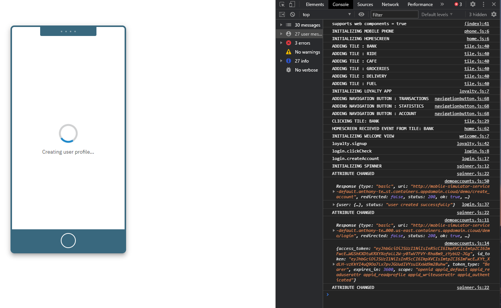

# Test the Simulator

Get the mobile simulator route.

```text
$ oc get routes
NAME                       HOST/PORT             PATH   SERVICES                           PORT    TERMINATION   WILDCARD
mobile-simulator-service   ***.appdomain.cloud          mobile-simulator-service           <all>                 None
```

Open the URL and open the console in the developer tools of your browser to view the access token. Try and test the Sign-up functionality.

The simulator will get stuck in the "Creating user profile..." loading screen. This is expected for now as you haven't deployed the other microservices of the Example Bank application.

You can also go back to your IBM Cloud App ID dashboard to view and manage the users that have been created.



## Summary

* Learned about Threat Modelling
* Explored App ID
* Built and Deploy Node.js microservice in OpenShift


Source code: [https://github.com/IBM/example-bank](https://github.com/IBM/example-bank)

More ways to use App ID https://cloud.ibm.com/docs/appid?topic=appid-adding-overview