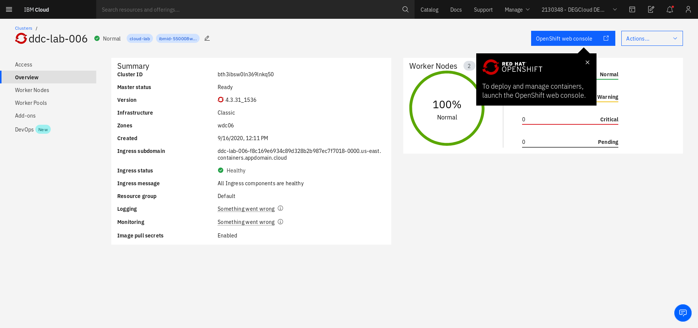

# Part 1

1. [Quickly install previous workshops](#1-quickly-install-previous-workshops)
1. [Build Java microservices](#2-build-java-microservices)

## 1. Quickly install previous workshops

*This step lets you quickly install the components that was deployed in Identity Management workshop and Operator workshop*

Clone the repo **example-bank**

```text
$ git clone https://github.com/IBM/example-bank
$ cd example-bank/scripts
```

Log in your IBM Cloud account with the `ibmcloud` cli

*Make sure to use your personal account when it asks you*

```text
$ ibmcloud login -u YOUR_IBM_CLOUD_EMAIL
```

Create an App ID instance using the script.

```text
$ ./createappid.sh

App ID instance created and configured
Management server: https://**.appid.cloud.ibm.com/management/v4/**
Api key:           YOUR_API_KEY
Auto-generated
appid-example-bank-credentials
```

Then export the App ID instance's management server and the API key.

```text
$ export MGMTEP=https://**.appid.cloud.ibm.com/management/v4/**
$ export APIKEY=YOUR_API_KEY
```

Log in with the OpenShift cluster provided for you using the OpenShift console. On the upper right corner, click your account and then click on `Copy Login Command`. This should open a new window and show you the command to login with the `oc` cli




Create a project called example-bank

```text
$ oc new-project example-bank
```

Deploy a Postgres instance in your OpenShift cluster

```text
$ ./deploy-db.sh

clusterserviceversion.operators.coreos.com/postgresql-operator.v0.1.1 created
subscription.operators.coreos.com/postgresql-operator-dev4devs-com created
operatorgroup.operators.coreos.com/example-bank-rgc7j unchanged
deployment.apps/postgresql-operator created
database.postgresql.dev4devs.com/creditdb created
```

Create secrets using the script below. This creates the necessary secrets in your OpenShift cluster

```text
$ ./createsecrets.sh $MGMTEP $APIKEY
```

Deploy the front end microservice from the Identity Management Workshop

```
$ cd ..
$ oc apply -f deployment.yaml
```


## 2. Build Java microservices

Build the microservices - user, transaction, and erasure microservices. You'll also build an image that would load the proper schema in the database.

First, you can build the schema and database model loader.

```
## make sure your are in the root directory of the example-bank repo
$ export DOCKER_HUB_USER=your-dockerhub-username
$ docker build -t $DOCKER_HUB_USER/lab-data:1.0 data_model
```

Then, build the transaction and user microservices

```
$ cd bank-app-backend
$ mvn -pl :transaction-service -am package
$ mvn -pl :user-service -am package
$ docker build -t $DOCKER_HUB_USER/lab-transaction:1.0 transaction-service
$ docker build -t $DOCKER_HUB_USER/lab-user:1.0 user-service
```

Then, build the erasure service

```
$ cd ../bank-user-cleanup-utility
$ mvn package
$ docker build -t $DOCKER_HUB_USER/lab-erasure:1.0 .
```

You can now push the container images you built 

```
$ docker login
$ docker push $DOCKER_HUB_USER/lab-data:1.0
$ docker push $DOCKER_HUB_USER/lab-transaction:1.0
$ docker push $DOCKER_HUB_USER/lab-user:1.0
$ docker push $DOCKER_HUB_USER/lab-erasure:1.0
```