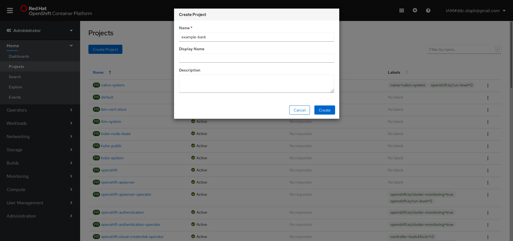
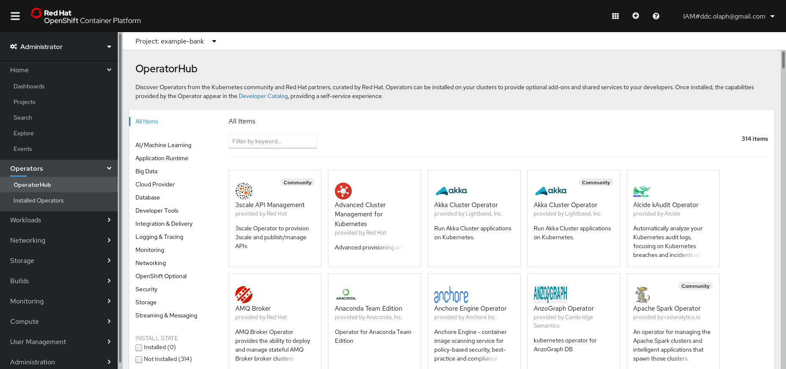
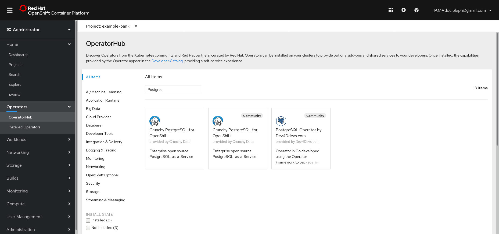
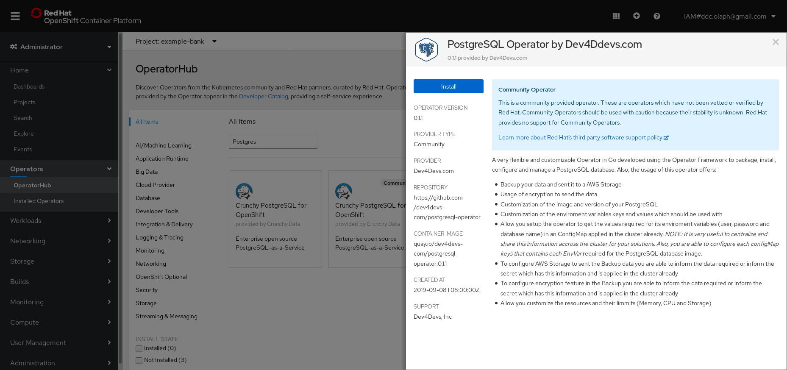
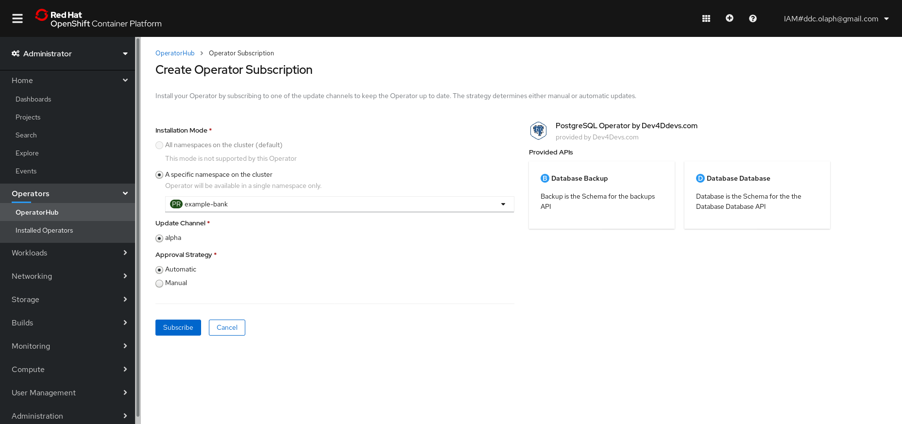

Use the IBM Cloud console to launch the OpenShift web console

First create an 'Example Bank' namespace

From the navigation menu on the left select **Operators** --> **OperatorHub**

Type 'Postgres' into the search bar, and select the **PostgreSQL Operator by Dev4Ddevs.com** tile.

Click **Continue** to show the community operator and then **Install**

Be sure you are installing the Operator in the `Example Bank` namespace, and click **Subscribe**

Status will show "Succeeded: Up to date" when complete

