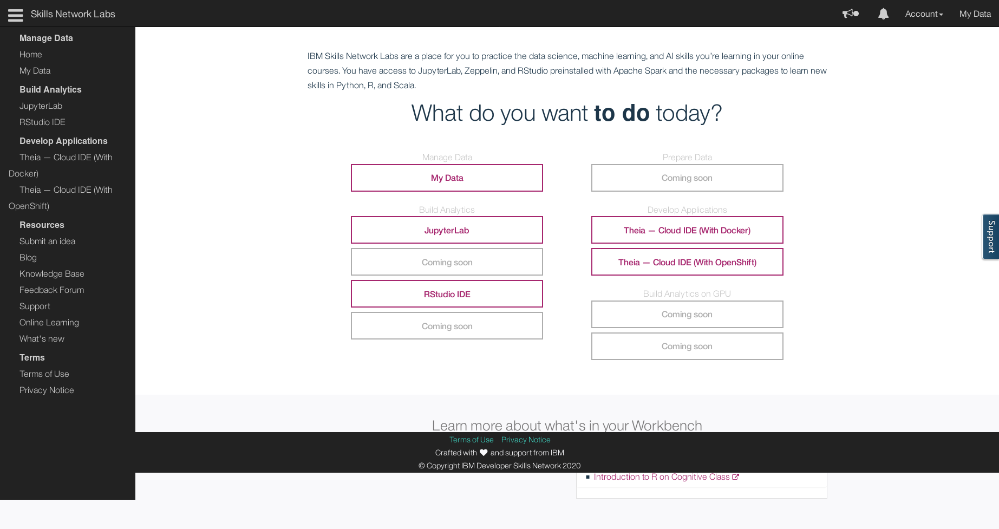
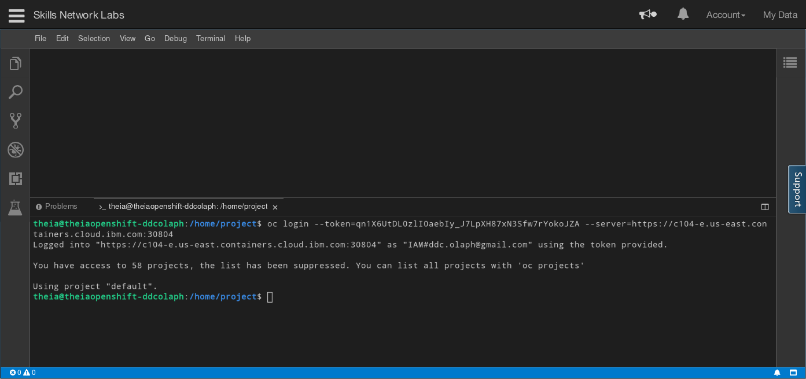

Now we will need some CLI access.  First, go to https://labs.cognitiveclass.ai and start a **Theia - Cloud IDE (With OpenShift)** session



back on your OpenShift web console, click you email address in the upper right corner and choose **Copy Login Command**


From the resulting screen, grab your login credentials, and copy them into your ClognitiveClass terminal



switch to the example bank project

```
git clone https://github.com/IBM/example-bank
```

Create a secret so the script that loads the schema can access the database

```
kubectl create secret generic bank-db-secret --from-literal=DB_SERVERNAME=creditdb --from-literal=DB_PORTNUMBER=5432 --from-literal=DB_DATABASENAME=example --from-literal=DB_USER=postgres --from-literal=DB_PASSWORD=postgres
```

Run the script to create the schema

```
oc apply -f data_model/job.yaml
```


