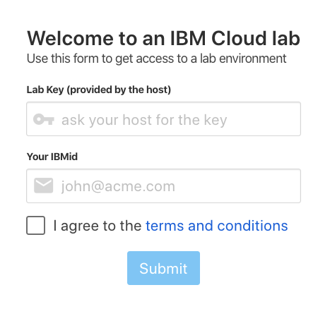
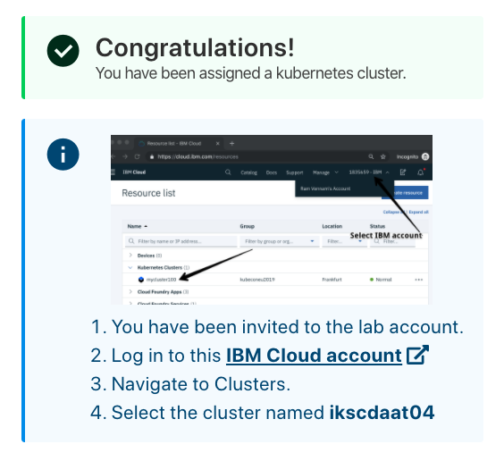
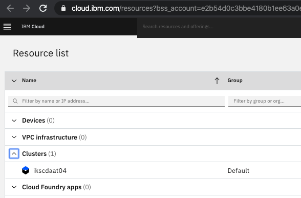
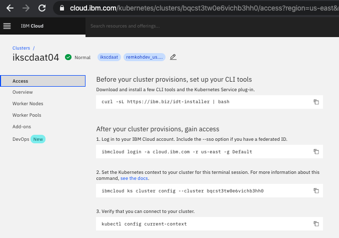
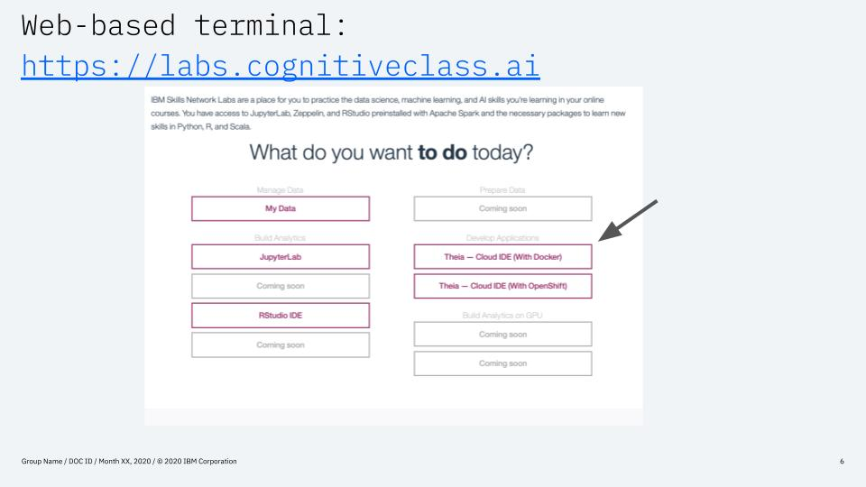

# Pre-work

This section is broken up into the following steps:

1. [Sign up for IBM Cloud](#1-sign-up-for-ibm-cloud)
1. [Request your cluster](#2-request-your-cluster)
1. [Web-based terminal](#3-web-based-terminal)

## 1. Sign up for IBM Cloud

Ensure you have an IBM Cloud ID

## 2. Request your cluster

For the hands-on labs, you will be given access to a temporary free kubernetes c
luster that was pre-created for the purpose of the workshop. The cluster will be
 deleted after the workshop. To gain access to this cluster:

* Open the URL that was provided to you by the instructor to access your cluster.

* Enter the workshop code provided by the workshop instructor and your IBM Cloud account IBM id. Select the terms and conditions checkbox and click the **`Submit`** button

* You will be added to a cloud account where a cluster has been pre-provisioned for you. Click on the link in the instructions which ask you to `Log in to this IBM Cloud account`.

* If you previously logged in to the IBM Cloud, the browser will direct you to the IBM Cloud resource list view (if you have not logged in previously, you will be asked to log in using your IBM Cloud ID). Expand the `Clusters` section and select the cluster assigned to you (the name will vary).

* Details for your cluster will load. Click on the `Access` menu item in the left navigation column, where you can find instructions to access your cluster from the command line client.

* Note the name of your cluster, you will use this cluster for this lab.

## 3. Web-based terminal

* Note: You can use any identity provider to log in to Skills Network Labs (does not have to be IBM Cloud).

