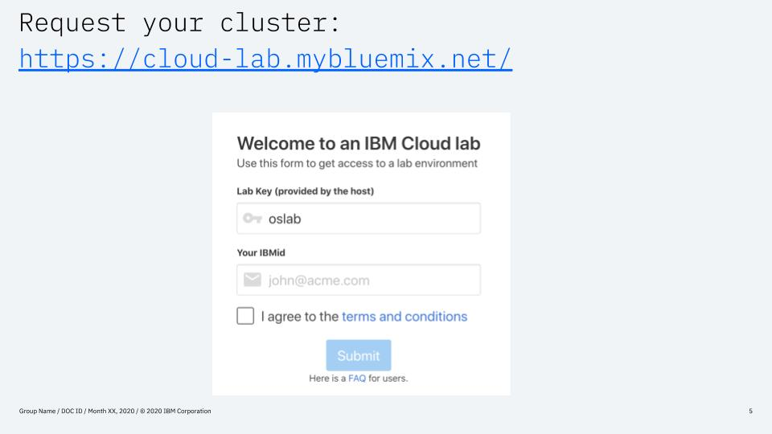

# Pre-work

This section is broken up into the following steps:

1. [Sign up for IBM Cloud](#1-sign-up-for-ibm-cloud)
1. [Request your cluster](#2-request-your-cluster)
1. [Web-based terminal](#3-web-based-terminal)

## 1. Sign up for IBM Cloud

Ensure you have an IBM Cloud ID

## 2. Request your cluster

## 3. Web-based terminal

