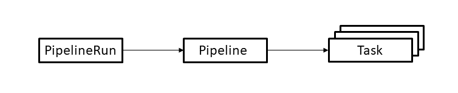

## Task

Defines a set of build steps such as compiling code, running tests, and building and deploying images.

## Pipeline

Defines the set of tasks that compose a pipeline.

## PipelineRun

Instantiates a Pipeline for execution with specific inputs, outputs, and execution parameters.
